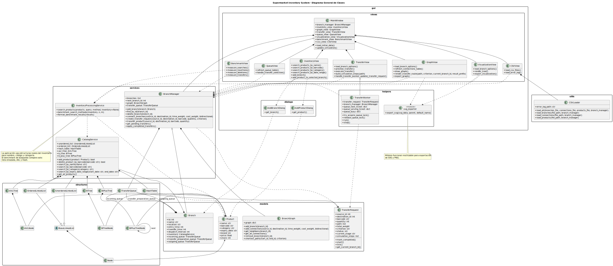
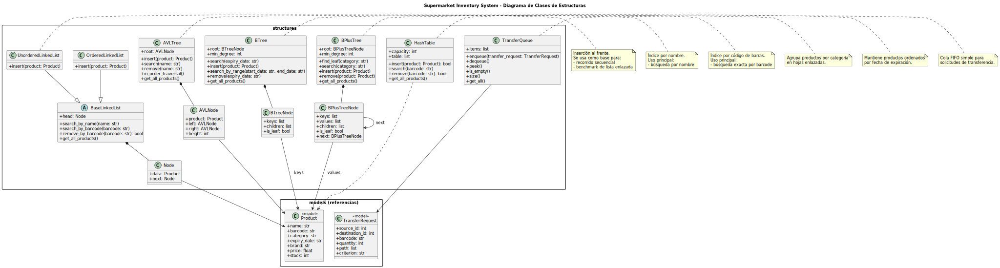
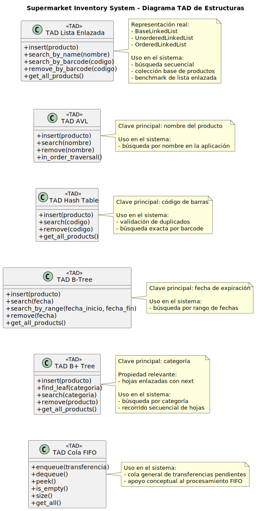
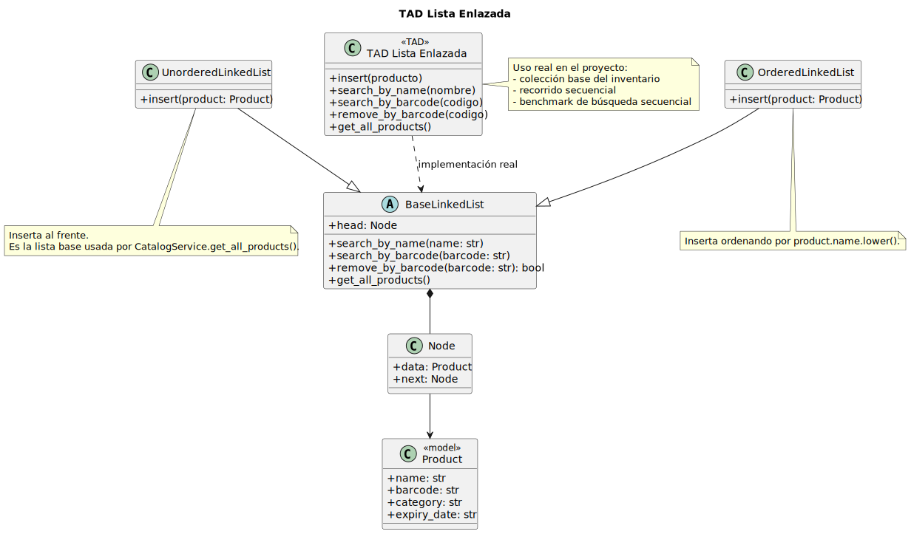
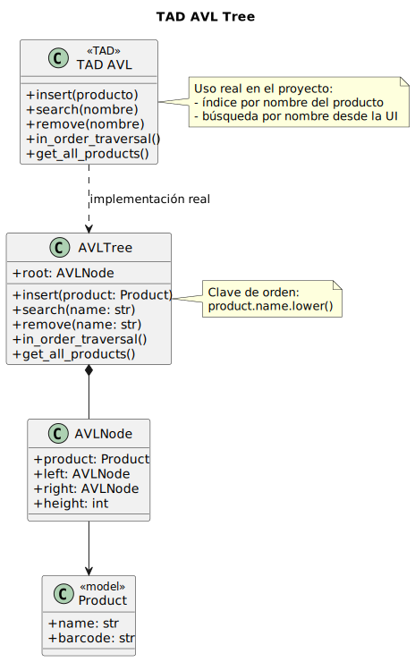
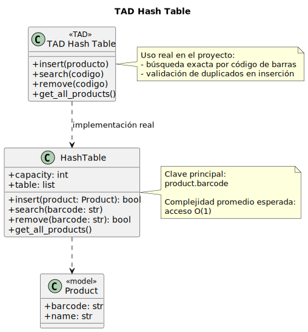
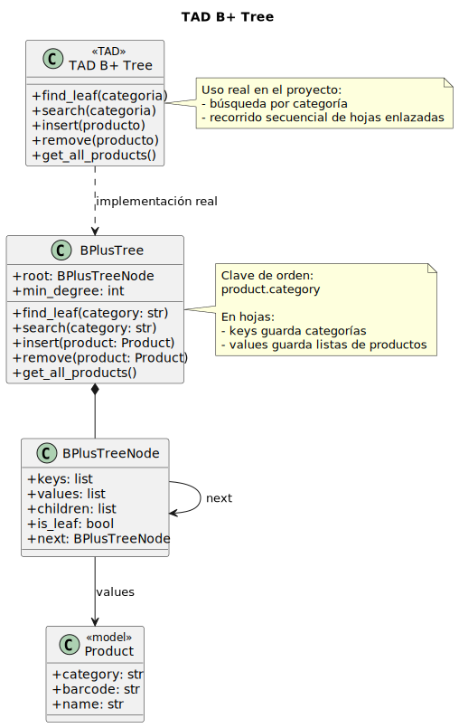
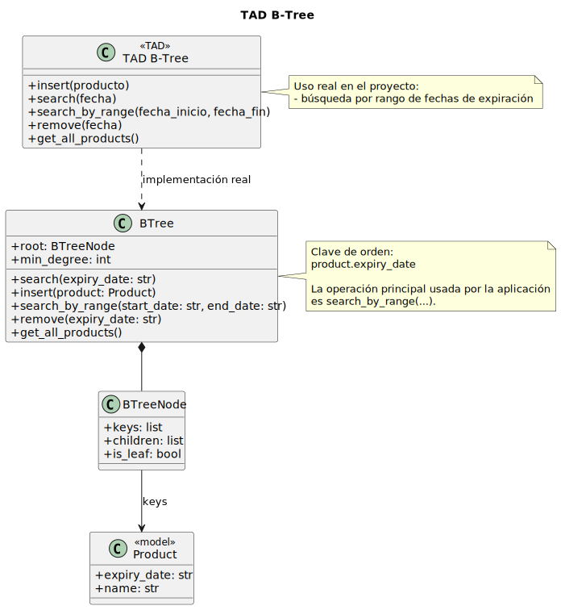
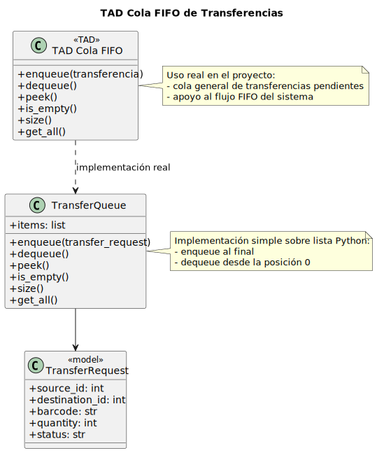
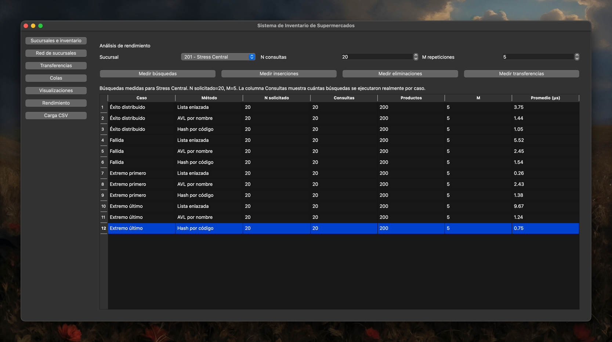

# Supermarket Inventory System - Reporte Técnico

## 1. Introducción

**Supermarket Inventory System** es una aplicación de escritorio para administrar sucursales, inventario, conexiones entre sucursales y transferencias de productos. El problema que resuelve es la gestión de inventario distribuido con búsquedas por distintos criterios, rutas entre sucursales y simulación concurrente de traspasos.

Las funciones principales del sistema son:

- registro y eliminación de sucursales
- registro y eliminación de productos
- búsqueda por nombre, código, categoría y rango de fechas
- cálculo de rutas por menor tiempo o menor costo
- simulación de transferencias con `QThread`
- carga masiva desde CSV con tolerancia a errores
- visualización y exportación de estructuras y grafos
- benchmark de búsquedas

## 2. Arquitectura del sistema

La aplicación está organizada dentro de `app/` con una separación clara entre dominio, lógica, estructuras y UI:

- `models/`: entidades centrales (`Product`, `Branch`, `TransferRequest`, `BranchGraph`)
- `services/`: lógica de negocio (`CatalogService`, `BranchManager`, `InventoryProcessingService`)
- `structures/`: implementaciones manuales de estructuras de datos
- `gui/views/`: módulos de interfaz
- `gui/helpers/`: utilidades de tablas, exportación y concurrencia
- `utils/`: carga de CSV, datos demo y generación de gráficos

La separación principal es:

- **lógica de negocio**: coordinación de sucursales, inventario y transferencias
- **estructuras de datos**: almacenamiento e indexación eficiente
- **interfaz gráfica**: operación del usuario, visualización y exportación

### Diagrama general del proyecto

## 3. Estructuras de datos utilizadas

### Vista general de estructuras

### 3.1 Lista enlazada

La lista enlazada se implementa mediante `BaseLinkedList`, `UnorderedLinkedList` y `OrderedLinkedList`. En el proyecto, la lista no es un respaldo decorativo: `CatalogService.get_all_products()` devuelve los productos desde `unordered_list`, y esa estructura también sirve como base para la búsqueda secuencial y para el benchmark.

**Justificación**:

- sirve como colección lineal base del inventario
- permite contrastar una búsqueda `O(n)` contra estructuras indexadas
- simplifica inserciones al frente en `UnorderedLinkedList`

**Complejidad**:

| Operación | Complejidad |
|---|---:|
| `insert` en `UnorderedLinkedList` | `O(1)` |
| `insert` en `OrderedLinkedList` | `O(n)` |
| `search_by_name` | `O(n)` |
| `search_by_barcode` | `O(n)` |
| `remove_by_barcode` | `O(n)` |
| `get_all_products` | `O(n)` |

### 3.2 AVL Tree

El árbol AVL se usa para **búsqueda por nombre**. `CatalogService` mantiene `avl_tree`, y `InventoryProcessingService.search_products(..., inventory=...)` lo utiliza cuando el método es `"name"`.

**Justificación**:

- mantiene balance automático
- da un costo predecible para búsqueda por nombre
- evita el crecimiento lineal típico de una lista

**Complejidad**:

| Operación | Complejidad |
|---|---:|
| `insert` | `O(log n)` |
| `search` | `O(log n)` |
| `remove` | `O(log n)` |
| `in_order_traversal` | `O(n)` |
| `get_all_products` | `O(n)` |

### 3.3 Tabla Hash

La tabla hash se usa para **búsqueda exacta por código de barras** y también para validar duplicados antes de insertar un producto nuevo.

**Justificación**:

- el código de barras es una clave exacta natural
- el acceso promedio es constante
- es la mejor estructura del proyecto para búsquedas puntuales por identificador

**Complejidad**:

| Operación | Promedio | Peor caso |
|---|---:|---:|
| `insert` | `O(1)` | `O(n)` |
| `search` | `O(1)` | `O(n)` |
| `remove` | `O(1)` | `O(n)` |
| `get_all_products` | `O(n)` | `O(n)` |

### 3.4 B+ Tree

El árbol B+ se usa para **búsqueda por categoría**. `CatalogService.search_by_category()` delega a `b_plus_tree.search(category)`. Además, sus hojas están enlazadas mediante `next`, y `get_all_products()` recorre esas hojas secuencialmente.

**Justificación**:

- agrupa productos por categoría
- conserva orden entre claves
- las hojas enlazadas permiten recorrido secuencial eficiente

**Complejidad**:

| Operación | Complejidad |
|---|---:|
| `find_leaf` | `O(log n)` |
| `search` | `O(log n)` |
| `insert` | `O(log n)` |
| `get_all_products` | `O(n)` |
| `remove` | `O(n log n)` |

La eliminación tiene costo mayor porque la implementación actual reconstruye el árbol a partir de los productos restantes.

### 3.5 B-Tree

El árbol B se usa para **búsqueda por rango de fechas de expiración**. `CatalogService.search_by_expiry_date_range()` usa `b_tree.search_by_range(start_date, end_date)`.

**Justificación**:

- mantiene productos ordenados por fecha
- permite consultas por rango sin recorrer toda la colección
- encaja mejor con fechas que con categorías exactas

**Complejidad**:

| Operación | Complejidad |
|---|---:|
| `search` | `O(log n)` |
| `insert` | `O(log n)` |
| `search_by_range` | `O(log n + k)` |
| `get_all_products` | `O(n)` |

`k` representa la cantidad de productos reportados por el rango.

### 3.6 Grafos

El sistema representa la red de sucursales con `BranchGraph`, un **grafo ponderado** implementado con un diccionario de adyacencia. Cada arista guarda:

- identificador de sucursal destino
- peso de tiempo
- peso de costo

**Justificación**:

- modela de forma natural rutas entre sucursales
- soporta conexiones unidireccionales y bidireccionales
- permite usar Dijkstra para minimizar tiempo o costo

**Complejidad**:

| Operación | Complejidad |
|---|---:|
| `add_branch` | `O(1)` |
| `add_connection` | `O(deg(v))` |
| `get_neighbors` | `O(1)` |
| `remove_branch` | `O(V + E)` |
| `shortest_path` con heap | `O((V + E) log V)` |

### 3.7 Colas

La cola implementada es `TransferQueue`. Se usa para la cola general de transferencias y como soporte conceptual del flujo FIFO. Internamente utiliza `deque`, por lo que `enqueue` y `dequeue` se realizan en tiempo constante.

**Justificación**:

- el orden de atención de transferencias es naturalmente FIFO
- simplifica el almacenamiento de solicitudes pendientes

**Complejidad**:

| Operación | Complejidad |
|---|---:|
| `enqueue` | `O(1)` |
| `dequeue` | `O(1)` |
| `peek` | `O(1)` |
| `is_empty` | `O(1)` |
| `size` | `O(1)` |
| `get_all` | `O(n)` |

`get_all` cuesta `O(n)` porque devuelve una copia de los elementos actuales de la cola.

## 4. Procesamiento de transferencias

Cada transferencia se ejecuta en un `QThread` mediante `TransferWorker`. Esto evita bloquear la UI durante la simulación.

El flujo modelado es:

- **cola de salida** en la sucursal origen
- **en tránsito** entre sucursales
- **cola de ingreso** en la sucursal destino
- **cola de preparación de traspaso** cuando existen sucursales intermedias

El control FIFO real se aplica por sucursal y por tipo de cola usando:

- `queue_next_ticket`
- `queue_serving_ticket`
- `queue_busy`
- `queue_mutex`

Si una transferencia queda en `Esperando FIFO`, el worker no llama `tick()`, por lo que no disminuye `remaining_time`, no aumenta `elapsed_time` y no avanza el progreso hasta adquirir el turno.

El stock solo se mueve cuando la transferencia completa es aplicada por `BranchManager`, no durante cada etapa intermedia.

## 5. Sistema de grafos

`BranchGraph` implementa las conexiones entre sucursales y el cálculo de rutas mínimas. El proyecto permite calcular:

- ruta de menor tiempo
- ruta de menor costo

La visualización del grafo se genera con Graphviz y puede exportarse a SVG y PNG. Esto facilita tanto la demostración académica como la depuración visual de rutas.

## 6. Manejo de archivos CSV

La carga de datos se realiza con `CSVLoader`, que aplica validación y tolerancia a errores:

- verifica existencia, lectura y formato de archivo
- lee con `utf-8-sig`
- respeta campos entre comillas, incluyendo comas internas como `"Fruits Company, Inc."`
- valida enteros, flotantes y códigos de barras
- registra errores por línea en `data/errors.log`
- continúa procesando filas válidas aunque existan errores en otras

Este enfoque evita que una fila defectuosa invalide toda la importación.

## 7. Búsquedas

La aplicación usa las estructuras reales del inventario:

- **AVL** para nombre
- **Hash** para código de barras
- **B+ Tree** para categoría
- **B-Tree** para rango de fechas
- **Lista enlazada** para búsqueda secuencial y benchmark

Esto es relevante porque la UI no opera sobre listas simuladas cuando hay inventario real disponible. `InventoryProcessingService.search_products(...)` enruta la consulta hacia la estructura correcta y mantiene búsqueda lineal como respaldo cuando la estructura indexada no devuelve coincidencias.

## 8. Benchmark y análisis de rendimiento

### 8.1 Metodología de medición

La medición se realizó sobre el código real del proyecto usando `time.perf_counter()`.

Se consideraron dos caminos:

1. **Benchmark integrado de búsquedas**:
   - sucursal mostrada en la evidencia: `201 - Stress Central`
   - productos medidos en la captura: `200`
   - consultas por caso: `N = 20`
   - repeticiones: `M = 5`
   - comparación: lista enlazada, AVL y Hash

Los valores reportados están en **microsegundos** y pueden variar entre equipos, versión de Python y carga del sistema.

### 8.2 Resultados experimentales de búsqueda

Promedio por consulta según la captura de benchmark adjunta para la sucursal `201 - Stress Central`:

| Caso | Lista enlazada (μs) | AVL (μs) | Hash (μs) |
|---|---:|---:|---:|
| Éxito distribuido | 3.75 | 1.44 | 1.05 |
| Fallida | 5.52 | 2.45 | 1.54 |
| Extremo primero | 0.26 | 2.43 | 1.38 |
| Extremo último | 9.67 | 1.24 | 0.75 |

Datos visibles en la misma evidencia:

- `N solicitado = 20`
- `Consultas = 20` por caso
- `Productos = 200`
- `M = 5`

**Lectura de resultados**:

- Hash fue el método más estable y rápido para búsqueda exacta por código.
- AVL mantuvo tiempos bajos para nombre, aunque en esta corrida quedó por encima de Hash.
- La lista enlazada depende fuertemente de la posición del elemento: buscar el primero fue muy barato, pero buscar el último o fallar fue mucho más costoso.

### 8.3 Comparación entre estructuras

La comparación práctica coincide con la teoría:

- **lista enlazada**: útil como línea base y para recorridos, pero no escala bien en búsquedas generales
- **AVL**: buena opción para nombres, con costo logarítmico estable
- **Hash**: mejor estructura para búsquedas exactas por código
- **B+ Tree**: apropiado para categorías y recorrido secuencial de hojas
- **B-Tree**: apropiado para rangos de fechas
- **grafo**: necesario para modelar rutas con pesos de tiempo y costo
- **cola FIFO**: necesaria para ordenar transferencias pendientes

## 9. Visualización y exportación

El sistema visualiza:

- grafo de sucursales
- árbol AVL
- árbol B
- árbol B+
- tabla hash

Además, exporta resultados gráficos en:

- **SVG**
- **PNG**

La exportación está centralizada en `app/gui/helpers/svg_exporter.py`, lo que evita duplicar lógica entre vistas.

## 10. Conclusiones

El proyecto demuestra una integración real entre estructuras de datos, concurrencia y visualización dentro de una aplicación funcional. No se trata solo de implementar estructuras aisladas, sino de conectarlas con casos de uso concretos:

- AVL para búsqueda por nombre
- Hash para búsqueda exacta por código
- B+ Tree para categorías
- B-Tree para fechas por rango
- grafo ponderado para rutas
- cola FIFO para transferencias

Los resultados experimentales muestran que la elección de estructura sí tiene impacto observable en tiempo de ejecución. En particular, Hash y AVL superan de forma clara a la lista enlazada en búsquedas indexadas, mientras que la simulación concurrente mantiene la interfaz reactiva sin romper el flujo FIFO por sucursal.

Desde el punto de vista académico, el proyecto es defendible porque:

- las estructuras están realmente implementadas en código
- la UI usa esas estructuras, no simulaciones paralelas
- las mediciones se basan en operaciones reales del sistema
- el diseño separa adecuadamente dominio, servicios, estructuras y presentación
