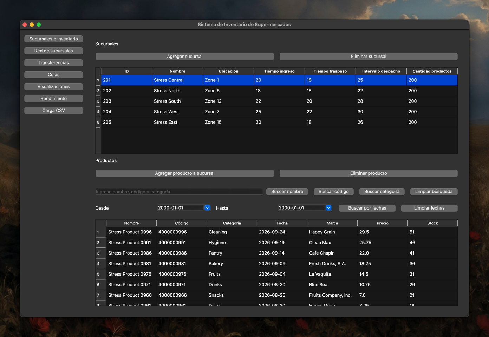
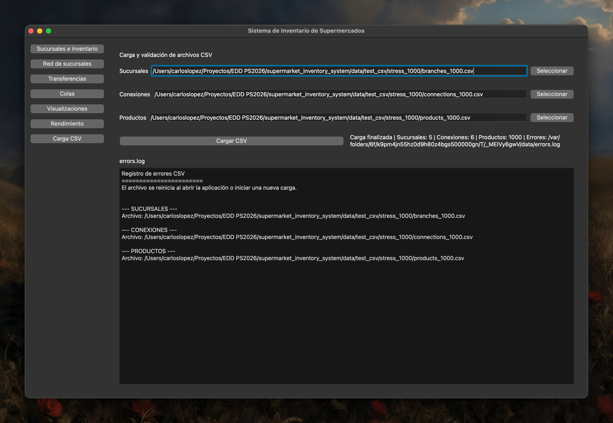
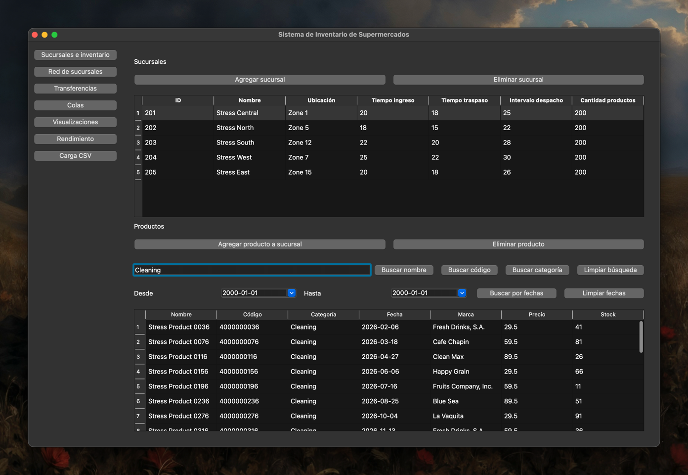
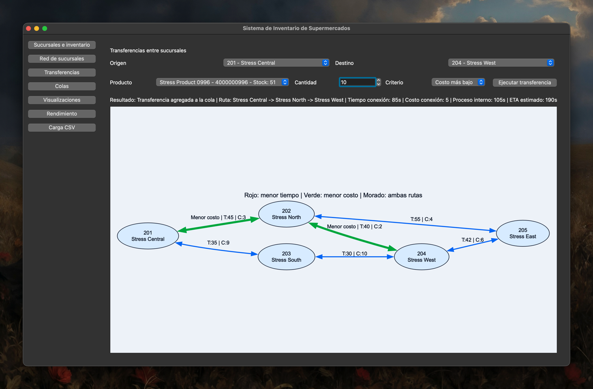
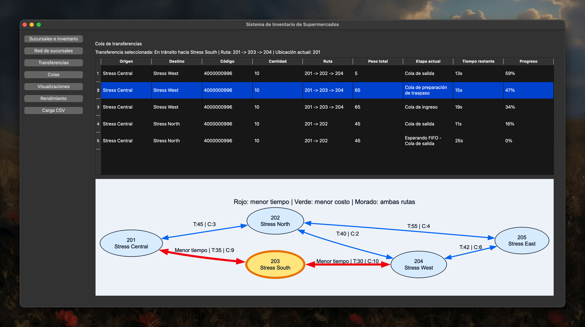
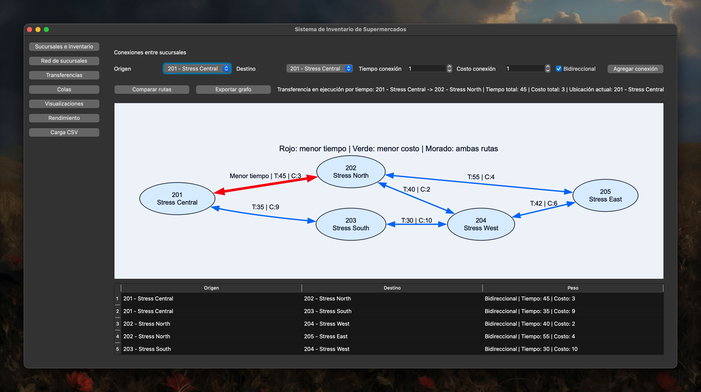
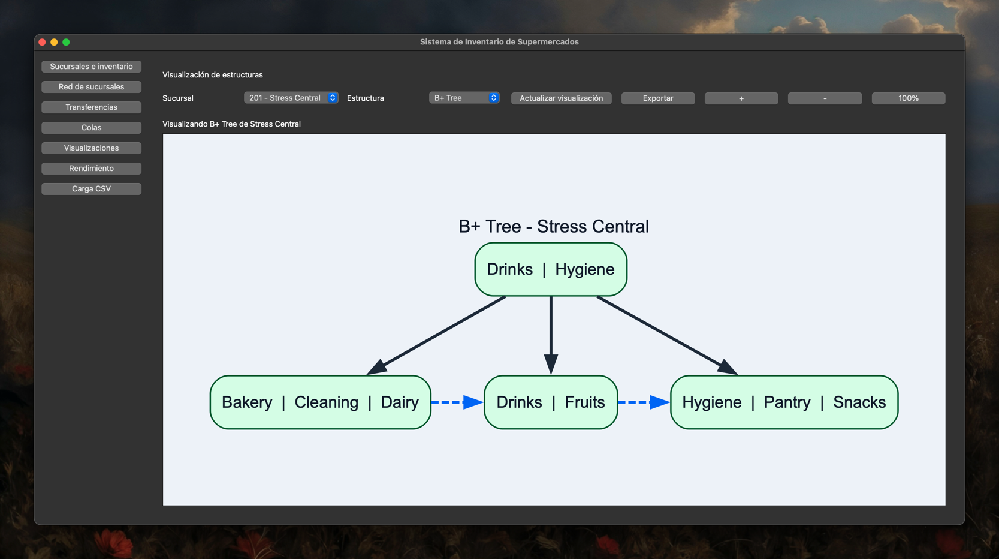

# Manual de Usuario

## 1. Introducción

Este manual describe cómo utilizar el sistema de inventario, rutas y transferencias entre sucursales. El objetivo es guiar el uso de las funciones principales de la aplicación con apoyo de capturas reales del proyecto.

## 2. Inicio de la aplicación

Ejecutar desde la raíz del proyecto:

```bash
python main.py
```

O usando el ejecutable generado:

```bash
./dist/main
```

Al iniciar, la ventana principal concentra los accesos a inventario, grafo, transferencias, colas, visualización de estructuras, benchmark y carga CSV.



## 3. Carga de datos CSV

Orden recomendado de carga:

1. Sucursales
2. Conexiones
3. Productos

Pasos:

1. Ir a la sección de carga CSV.
2. Seleccionar los tres archivos requeridos.
3. Confirmar la carga.
4. Revisar el mensaje de resultado y el área de errores si aplica.

La carga es tolerante a errores: una fila inválida no detiene todo el proceso.



## 4. Búsqueda de productos

Opciones disponibles:

- nombre
- código de barras
- categoría
- fecha por rango

Las búsquedas usan las estructuras reales del sistema:

- nombre: AVL
- código de barras: Hash
- categoría: B+ Tree
- fecha por rango: B-Tree

Ejemplo de búsqueda por categoría:



Las búsquedas por nombre, código y fecha siguen el mismo flujo desde la vista de inventario: seleccionar sucursal, ingresar criterio y ejecutar la consulta correspondiente.

## 5. Transferencias

Pasos:

1. Seleccionar sucursal origen.
2. Seleccionar sucursal destino.
3. Seleccionar producto.
4. Elegir cantidad.
5. Elegir criterio de ruta: tiempo o costo.
6. Confirmar la transferencia.

La vista muestra la ruta estimada y el estado general de la operación.



## 6. Colas FIFO

Cada sucursal respeta orden FIFO por cola. Cuando una transferencia no puede avanzar, su estado cambia a espera FIFO y permanece pausada hasta que la cola se libera.

La tabla de colas permite observar:

- estado actual
- etapa activa
- progreso
- ruta de la transferencia



## 7. Grafo de sucursales

La sección de grafos permite:

- registrar conexiones entre sucursales
- visualizar la red completa
- comparar rutas por tiempo o costo
- resaltar una ruta calculada



## 8. Visualización de estructuras

La aplicación puede renderizar varias estructuras del inventario:

- AVL
- Hash Table
- B Tree
- B+ Tree

Ejemplo de visualización de B+ Tree:



La exportación de estas visualizaciones puede hacerse en SVG o PNG desde la propia interfaz.

## 9. Benchmark

La sección de benchmark muestra resultados de rendimiento para búsquedas sobre:

- lista enlazada
- AVL
- Hash

Los resultados se presentan en microsegundos y permiten contrastar los distintos métodos según el caso de prueba.


## 10. Manejo de errores

Cuando un archivo CSV es inválido o contiene filas erróneas:

- el sistema muestra el resultado de la carga
- registra los errores en `errors.log`
- continúa procesando las filas válidas restantes

Esto permite detectar problemas sin perder completamente la carga de datos.

## 11. Datasets de prueba

Uso sugerido:

- dataset básico o con errores: demostración funcional
- dataset grande: pruebas de rendimiento y benchmark

Si se trabaja con grandes volúmenes, conviene cargar esos datos por separado para aislar las pruebas de rendimiento del resto de demostraciones funcionales.
